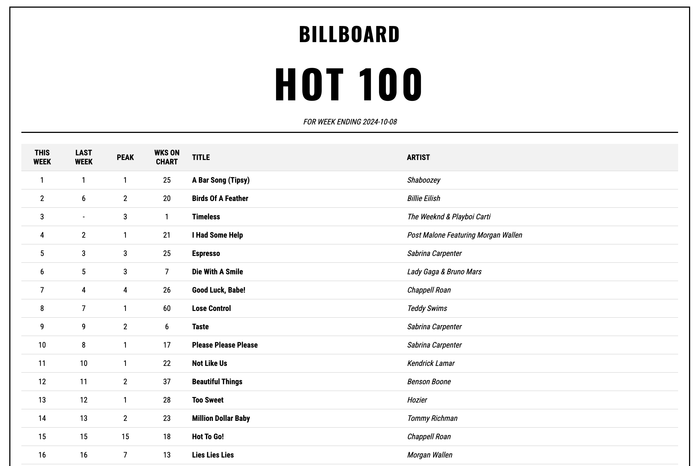

# Billboard Hot 100 Chart Generator

I wanted to browse the billboard charts, but I didn't want to deal with the bullshit of Billboard's website. So I made this.



## Setup Instructions

1. Clone this repository:
   ```
   git clone https://github.com/your-username/billboard-chart-generator.git
   cd billboard-chart-generator
   ```

2. Install dependencies:
   ```
   npm install
   ```

3. Start the server:
   ```
   npm start
   ```

4. Open your web browser and navigate to:
   ```
   http://localhost:3000
   ```

## Project Structure

- `src/server.js`: Express server setup
- `src/htmlTemplate.js`: HTML generation logic
- `src/styles.js`: CSS styles for the charts
- `public/`: Directory for static assets (like images)

## Features

- Dynamically fetches the latest Billboard chart data
- Displays Hot 100, Artist 100, and Billboard 200 charts
- Responsive design for various screen sizes

## Data Source

This project uses data from the [billboard-json](https://github.com/KoreanThinker/billboard-json) repository, which provides up-to-date Billboard chart data in JSON format.

## Contributing

Contributions are welcome! Please feel free to submit a Pull Request.

## License

This project is open source and available under the [MIT License](LICENSE).